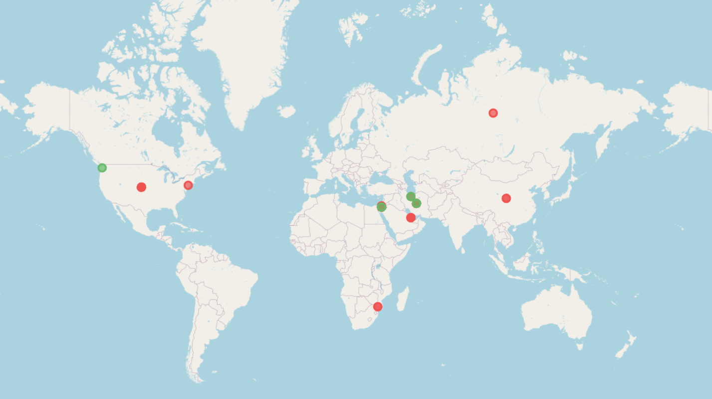
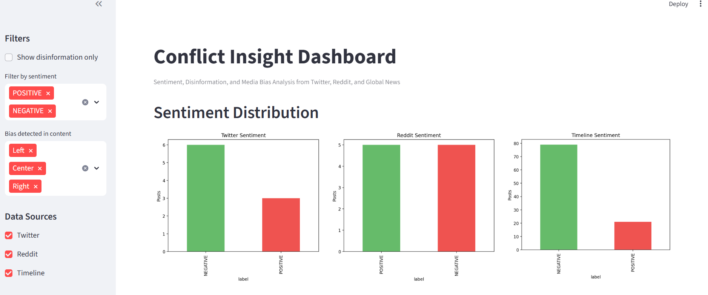
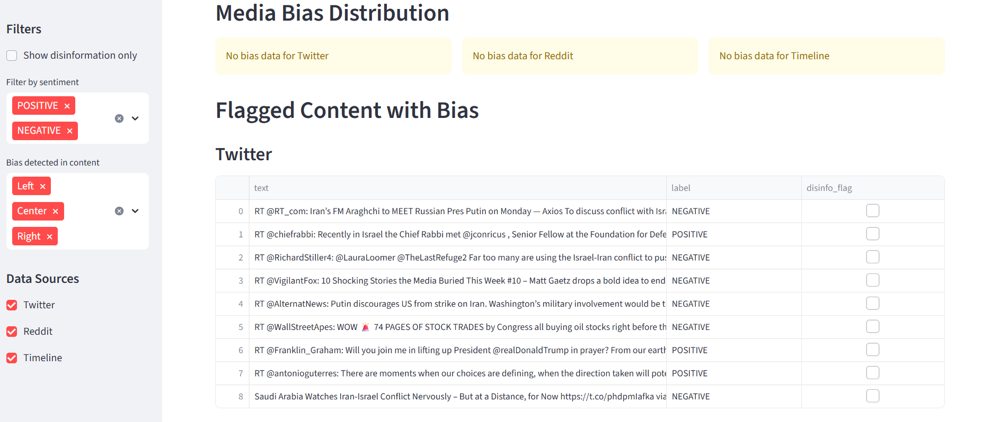
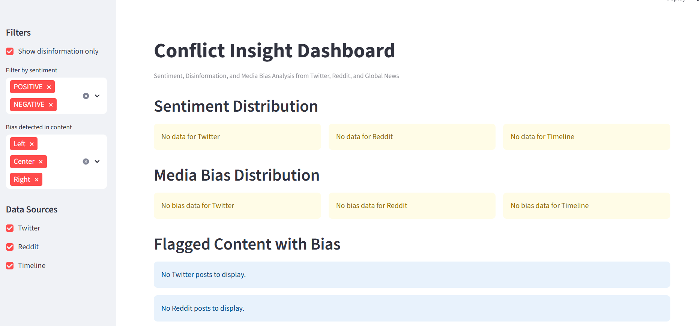
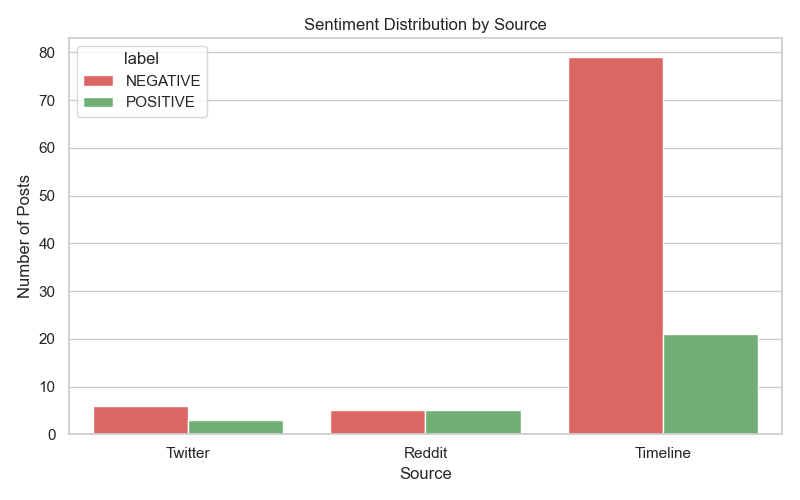

# Conflict Insight Dashboard

An interactive dashboard and data pipeline for analyzing **public sentiment**, detecting **disinformation**, uncovering **media bias**, and mapping **geographic trends** related to the **Israel–Iran conflict**. It pulls content from Twitter, Reddit, and Google News timelines — combining machine learning and NLP into a single exploratory platform.

---

## Features

- Scrape recent tweets using keyword queries
- Pull top Reddit titles from global news communities
- Extract conflict-related news timelines from Google News
- Classify sentiment on each post or headline
- Detect potential disinformation with linguistic rules
- Identify partisan media bias using AI (via IsItCap)
- Geolocate conflict mentions and render interactive maps
- Visualize and filter all of it in a Streamlit dashboard

---

## Project Structure

```plaintext
conflict-insight/
├── .github/
│   └── workflows/
│       └── test.yml                  # CI for testing with pytest
│
├── data/                             # (Optional) raw data or temp input cache
├── logs/                             # (Optional) logging outputs
├── notebooks/                        # (Currently empty – for exploratory work)
├── outputs/                          # Final CSVs and visualizations
├── src/                              # Main pipeline modules
│   ├── reddit_scraper.py
│   ├── sentiment_analysis.py
│   ├── timeline_detector.py
│   ├── twitter_scraper.py
│   └── __init__.py
│
├── bias_detector.py                  # AI bias scoring via Selenium (IsItCap)
├── dashboard.py                      # Streamlit dashboard interface
├── disinfo_detector.py               # NLP-based disinformation flagger
├── geo_mapper.py                     # Geolocation + map rendering (Folium)
├── run_disinfo.py                    # Standalone disinfo flagging runner
├── run_pipeline.py                   # Primary pipeline: scrape + sentiment
├── visualize_sentiment.py            # Plots: sentiment_by_source.png
├── requirements.txt
├── .env.example
├── .gitignore
└── README.md
```

---

## Quickstart

### 1. Install dependencies

```bash
pip install -r requirements.txt
python -m spacy download en_core_web_sm
```

### 2. Setup environment

```bash
cp .env.example .env
```

Update your .env with API credentials:

```bash
TWITTER_BEARER_TOKEN=...
REDDIT_CLIENT_ID=...
REDDIT_CLIENT_SECRET=...
REDDIT_USER_AGENT=...
```

### 3. Run the pipeline (scrape + sentiment)

```bash
python run_pipeline.py
```

This fetches:
- Tweets, Reddit titles, and news headlines
- Applies sentiment classification
- Outputs results to /outputs

### 4. Disinformation detection

```bash
python run_disinfo.py
```

Adds disinfo_flag to each row using rule-based filtering.

### 5. Media bias detection

```bash
python bias_detector.py
```
Uses Selenium to submit timeline headlines to IsItCap.com for bias/confidence/framing detection.
* Requires chromedriver installed and in PATH.

### 6. Generate Interactive Conflict Map

```bash
python geo_mapper.py
```
Creates sentiment_map.html — an interactive Folium map of geocoded headlines, colored by sentiment and disinfo flag




### 7. Run the Dashboard

```bash
streamlit run dashboard.py

or

python -m streamlit run dashboard.py
```

Includes:
- Source toggles (Twitter, Reddit, Timeline)
- Sentiment filters
- Disinfo toggle
- Bias filters
- Location tagging (from geo_mapper)





### 8. Visualize Sentiment

```bash
python visualize_sentiment.py
```
Plots sentiment distribution by source



## Notes
- All processed outputs saved in /outputs/
- Raw data from APIs is not versioned
- Dashboard styling supports light/dark mode (automatically detects)

## License
MIT License — open, forkable, remix-friendly.

## Created By
Crafted by Juan Rafael Vidal — Data Scientist, DevOps Engineer, info-sleuth and code-slinger.
Building a dashboard that listens louder, thinks deeper, and maps the storm before the headlines even cool.
Fueled by data. Focused on truth. Designed to outpace disinfo.